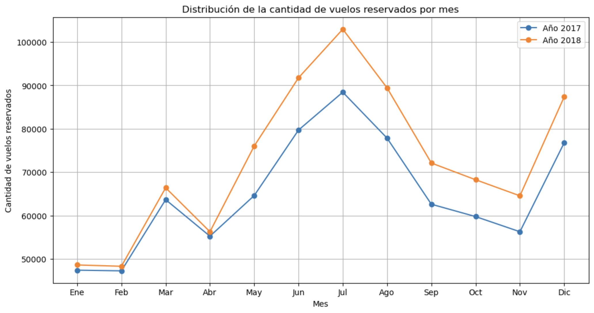
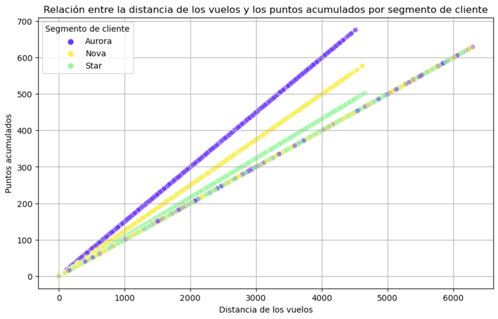

# Evaluación Final del Módulo 3 📊

## Objetivo 🎯

El objetivo de esta evaluación es comprobar la comprensión y habilidades en análisis de datos mediante la realización de un A/B Testing y pruebas estadísticas. Utilizaremos un conjunto de datos de clientes con diferentes niveles educativos y sus reservas de vuelos para determinar si existen diferencias significativas en el número de vuelos reservados entre los diferentes niveles educativos. Además, se evaluará la capacidad para realizar una exploración y limpieza de datos, visualización de datos y el uso de procesos ETL y Pipelines en el contexto de análisis de datos.

---

## Estructura 🏗️

La evaluación consta de tres fases:

1. **Exploración y Limpieza**:
    - Exploración inicial de los datos para identificar posibles problemas como valores nulos o atípicos.
    - Limpieza de datos para asegurar consistencia y corrección, incluyendo eliminación o tratamiento de valores nulos y ajustes de tipos de datos.

2. **Visualización**:
    - Creación de gráficas para analizar la distribución de vuelos reservados por mes, relación entre distancia de vuelos y puntos acumulados, distribución de clientes por provincia o estado, comparación de salario promedio entre niveles educativos, proporción de clientes con diferentes tarjetas de fidelidad, y distribución de clientes por estado civil y género.

3. **Evaluación de Diferencias en Reservas de Vuelos por Nivel Educativo**:
    - Preparación de datos filtrando las columnas relevantes.
    - Análisis descriptivo agrupando datos por nivel educativo y calculando estadísticas básicas.
    - Realización de un A/B Testing para determinar si existen diferencias significativas en el número de vuelos reservados entre los diferentes niveles educativos.

---

### Herramientas y Librerías 🛠️

En esta evaluación se utilizaron diversas herramientas y librerías para el análisis y visualización de datos, así como para la ejecución de pruebas estadísticas. A continuación, se detallan las principales herramientas y librerías utilizadas:

#### Visual Studio Code

[Visual Studio Code](https://code.visualstudio.com/) es un editor de código fuente desarrollado por Microsoft. Es una herramienta poderosa y extensible, ideal para programar en diversos lenguajes y gestionar proyectos de datos. En esta evaluación, se utilizó Visual Studio Code para escribir, ejecutar y depurar el código Python necesario para el análisis de datos y la visualización.

#### Jupyter Notebooks

[Jupyter Notebooks](https://jupyter.org/) En esta evaluación, se utilizaron archivos Jupyter Notebooks (extensión .ipynb) para la exploración interactiva de datos y la creación de gráficos.

#### Librerías de Python 📖

##### Tratamiento de Datos

- **Pandas**: [Pandas](https://pandas.pydata.org/) es una librería fundamental para el análisis y manipulación de datos en Python. Ofrece estructuras de datos y funciones de manipulación de datos de alto rendimiento.

- **NumPy**: [NumPy](https://numpy.org/) es una librería esencial para el cálculo científico en Python. Proporciona soporte para arrays y matrices, junto con una colección de funciones matemáticas.

- **itertools**: [itertools](https://docs.python.org/3/library/itertools.html) es un módulo de la biblioteca estándar de Python que ofrece funciones que crean iteradores eficientes. En este proyecto, se utilizó para generar combinaciones.

##### Evaluación de la Linealidad y Distribución de Variables

- **SciPy**: [SciPy](https://scipy.org/) es una librería que proporciona rutinas y algoritmos matemáticos y estadísticos. En esta evaluación, se utilizó para realizar pruebas estadísticas como Shapiro-Wilk y Kolmogorov-Smirnov.

##### Visualización de Datos

- **Seaborn**: [Seaborn](https://seaborn.pydata.org/) es una librería de visualización de datos basada en Matplotlib. Proporciona una interfaz de alto nivel para dibujar gráficos estadísticos atractivos y informativos.

- **Matplotlib**: [Matplotlib](https://matplotlib.org/) es una librería de trazado de gráficos en 2D para Python. Es utilizada para crear gráficos estáticos, animados e interactivos.

##### Creación de Muestras

- **Scikit-learn**: [Scikit-learn](https://scikit-learn.org/) es una librería de aprendizaje automático en Python. Se utilizó para generar muestras del conjunto de datos.

##### Importación de Módulos Propios 👩🏻‍💻

Durante esta evaluación, también se trabajó con módulos Python personalizados, lo cual facilitó la organización y reutilización del código. Estos módulos se importaron y utilizaron para diversas funciones y análisis específicos.

---

## Temas Aprendidos 📚

Durante esta evaluación, se cubrieron varios temas clave relacionados con la manipulación, análisis y visualización de datos, así como la aplicación de pruebas estadísticas. A continuación, se detallan los principales temas aprendidos:

### 1. Exploración y Limpieza de Datos

#### Exploración Inicial

- **Inspección de Datos**: Utilización de funciones de Pandas para obtener información sobre la estructura de los datos, la presencia de valores nulos y estadísticas básicas de las columnas involucradas.
- **Identificación de Problemas**: Detección de valores nulos, atípicos o datos faltantes en las columnas relevantes.

#### Limpieza de Datos

- **Tratamiento de Valores Nulos**: Eliminación o tratamiento de valores nulos en las columnas clave para asegurar que los datos estén completos.
- **Consistencia de Datos**: Verificación de la consistencia y corrección de los datos para garantizar su coherencia.
- **Ajuste de Tipos de Datos**: Realización de ajustes o conversiones necesarias en las columnas (por ejemplo, cambiar tipos de datos) para asegurar la adecuación de los datos para el análisis estadístico.

### 2. Visualización de Datos

Se utilizaron diversas técnicas de visualización para responder preguntas específicas y explorar las relaciones entre las variables. A continuación, se presentan dos ejemplos de gráficos generados durante la evaluación:

#### Distribución de la cantidad de vuelos reservados por mes

#### Relación entre la distancia de los vuelos y los puntos acumulados por segmento de cliente

### 3. Evaluación de Diferencias en Reservas de Vuelos por Nivel Educativo

#### Preparación de Datos

- **Filtrado de Datos**: Filtrado del conjunto de datos para incluir únicamente las columnas relevantes ('Flights Booked' y 'Education').

#### Análisis Descriptivo

- **Agrupación por Nivel Educativo**: Agrupación de los datos por nivel educativo utilizando la función `groupby` y cálculo de estadísticas descriptivas básicas (como el promedio, la desviación estándar y los percentiles) del número de vuelos reservados para cada grupo.

- **Uso de `apply` y Funciones Lambda**: Utilización de la función `apply` junto con funciones lambda para transformar datos y aplicar funciones personalizadas a los DataFrames. Esto permitió realizar operaciones complejas de manera concisa y eficiente.

#### Pruebas Estadísticas

- **Prueba de Normalidad**: Realización de pruebas de normalidad utilizando los métodos de Shapiro-Wilk y Kolmogorov-Smirnov para evaluar la distribución de los datos.
- **Prueba de Mann-Whitney U**: Aplicación de la prueba de Mann-Whitney U para comparar las medianas de las métricas entre dos grupos y determinar si existe una diferencia significativa en el número de vuelos reservados entre los diferentes niveles educativos.

### 4. Creación e Interpretación de Gráficas

- **Seaborn y Matplotlib**: Creación de diversas gráficas utilizando las librerías Seaborn y Matplotlib para visualizar y analizar los datos de manera efectiva.
- **Análisis de Gráficos**: Interpretación de las gráficas para extraer conclusiones y responder preguntas específicas del análisis.

---

Estos temas demuestran un enfoque integral para el análisis de datos, abarcando desde la exploración y limpieza hasta la visualización y análisis estadístico. Esta metodología permite obtener una comprensión detallada de los datos y tomar decisiones basadas en resultados sólidos y bien fundamentados. Para ver más ejemplos de este tipo de análisis y explorar en detalle mi trabajo, te invito a visitar el repositorio del proyecto: ➡️ [Enlace al repositorio](https://github.com/Adalab/bda-modulo-3-evaluacion-final-MaPitelli)